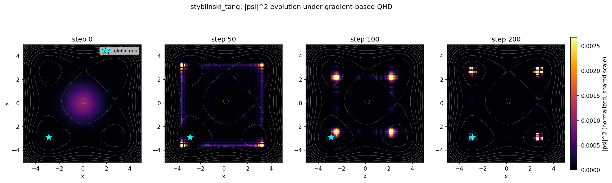
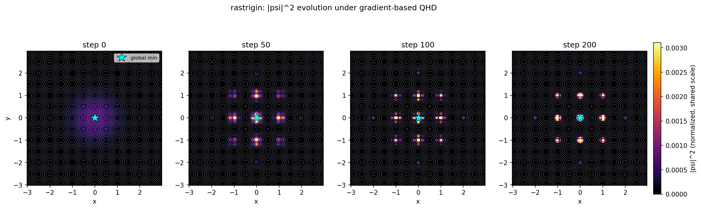
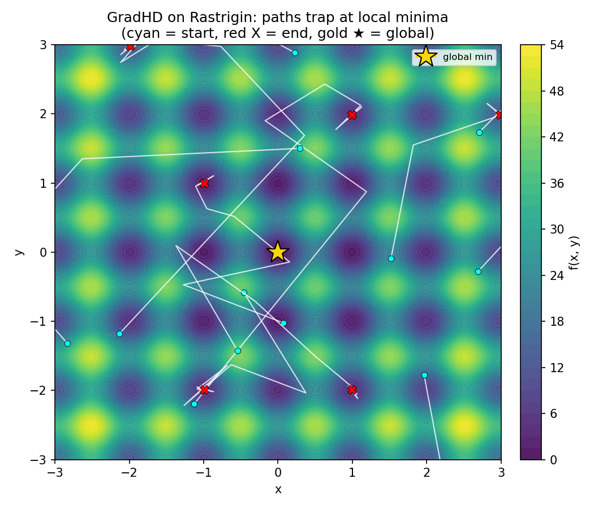

# grad-qhd

A three-part study of **gradient-based Quantum Hamiltonian Descent (QHD)** and
**barren plateau mitigation in variational quantum circuits** —
Leng & Shi, *"Quantum Optimization via Gradient-Based Hamiltonian Descent"*,
ICML 2025 ([arXiv:2505.14670](https://arxiv.org/abs/2505.14670)).

**Demonstrates:** a faithful classical PDE simulation of a quantum optimization
algorithm in 2D; a classical QHD-inspired optimizer that comes out **neutral vs
Adam** on real neural-network training; a direct test pinning down *when* the
quantum advantage exists at all — it is **landscape-dependent**, decisive only
where local minima are dense enough to strand classical methods; and an empirical
study of barren plateau mitigation strategies for variational quantum circuits on
real image classification.

---

## The three parts, and the honest line between them

Gradient-based QHD evolves a quantum **wave function** ψ(t, x) over a spatial
grid via a Schrödinger PDE, and reads out a solution by sampling |ψ|². Its power
— escaping local minima by **quantum tunneling** — comes from that non-local
quantum state. Simulating it classically costs Nᵈ grid points, so the paper (and
this repo) is limited to 2D problems.

- **Part A** reproduces the **real** algorithm on 2D test functions, where it is
  classically simulable. This is genuine QHD.
- **Part B** is a **classical** optimizer, *GradHD*, inspired by the structure of
  the gradient-corrected classical Hamiltonian dynamics in the paper. It drops
  the wave function and tunneling entirely. **It is not QHD, not quantum, and has
  no tunneling.** Its corrections come from a classical gradient-flow update, and
  with its three extra coefficients set to zero it is *exactly* Adam.
- **Part C** is a study of **barren plateau mitigation** in quantum–classical
  hybrid models (QCQ-CNN) for brain MRI classification. It characterises the
  exponential gradient vanishing, then evaluates three mitigations: local cost
  function, layer-by-layer training, and quantum transfer learning.

These are kept strictly separate everywhere. The interesting scientific outcome
is that Part B is **neutral vs Adam**, and — run on the same 2D landscapes as
Part A — the QHD edge appears only where local minima are dense, evidence that
QHD's advantage was the tunneling the classical discretization cannot reproduce.
Part C's key finding is that **local measurements** (per-qubit Z_i instead of
global Z⊗...⊗Z) is the single most impactful mitigation at small qubit counts.

---

## Part A — faithful gradient-based QHD on 2D landscapes

Split-operator Fourier (pseudo-spectral) integration of i ∂ₜψ = H(t)ψ with
H = H₁ + H₂ + H₃:

| Term | Operator | How it is applied |
|---|---|---|
| H₁ (kinetic) | −(1/2t³)∇² | FFT → phase multiply → IFFT (exactly unitary) |
| H₂ (gradient correction) | (α/2){−i∇, ∇f} | Crank–Nicolson / Cayley transform via GMRES (exactly unitary) |
| H₃ (potential) | ((α²+β)/2)t³‖∇f‖² + (t³+γt²)f | pointwise phase multiply (exactly unitary) |

Strang splitting per step: H₁(h/2)·H₂(h/2)·H₃(h)·H₂(h/2)·H₁(h/2).

**Key numerical fix — 2/3-rule dealiasing.** The H₃ phase rotations make ψ
oscillatory; its FFT content then aliases past the Nyquist frequency, which
corrupts the spectral gradient inside H₂, breaks the operator's anti-Hermiticity,
and makes ‖ψ‖ blow up (E[f] → +70 by step ~30). Zeroing the top third of Fourier
modes after each H₃ step removes the aliasing and keeps the evolution
norm-preserving. With this fix E[f] decreases monotonically and ‖ψ‖ ≈ 1.

### The wave function concentrates (why QHD works)

The premise of Part A is that |ψ|² concentrates near the global minimum. It does
— a broad Gaussian (step 0) spreads, explores, then collapses onto the low-f
basins by step 200, heaviest at the global minimum (★):




The discrete norm Σ|ψ|² = 1 holds at every captured step (raw per-step ‖ψ‖ stays
within ~2 % of 1, the bounded dealiasing drift). Reproduce with
`python partA_qhd_pde/plot_psi_evolution.py`.

### Results (N=128, K=200; baselines over 1000 random inits)

Grad-QHD vs **standard QHD** (= α=β=γ=0, the free special case). P[near] =
P[f(X_k) − f* ≤ 1].

| Function | grad-QHD E[f] | grad-QHD P[near] | std-QHD E[f] | std-QHD P[near] |
|---|---|---|---|---|
| Styblinski–Tang | **−23.06** | **0.106** | −19.02 | 0.025 |
| Michalewicz | **−1.30** | **0.903** | −1.03 | 0.711 |
| Cube-Wave | **0.061** | **0.983** | 0.099 | 0.956 |
| Rastrigin | **2.68** | **0.153** | 3.40 | 0.123 |

Gradient-based QHD reaches lower terminal values and higher success than standard
QHD on **every** function — the paper's central qualitative claim, reproduced.

Classical baselines (SGDM and NAG, 1000 random inits each):

| Function | SGDM E[f] | SGDM P[near] | NAG E[f] | NAG P[near] |
|---|---|---|---|---|
| Styblinski–Tang | −24.38 | 0.222 | −25.87 | 0.267 |
| Michalewicz | −0.56 | 0.335 | −0.74 | 0.602 |
| Cube-Wave | 0.539 | 0.557 | 1.018 | 0.271 |
| Rastrigin | 9.78 | 0.064 | 6.41 | **0.000** |

Against the baselines the picture is **split**, and honestly so. Grad-QHD beats
both SGDM and NAG on the three hardest multimodal functions — Michalewicz,
Cube-Wave, and Rastrigin (where NAG reaches **0%** success and SGDM only 6%). But
on the smoother **Styblinski–Tang the momentum baselines win** (NAG −25.87 / 0.267
vs grad-QHD −23.06 / 0.106): a single dominant basin is exactly what momentum
methods handle well, so the quantum spreading offers no edge there.

**The convex landscape is excluded** from the main comparison: its non-periodic
quartic makes the Fourier spectral Laplacian ring (Gibbs, |∇²f| up to ~2×10⁴),
which ill-conditions the H₂ solve (κ≈128 vs ≈1.3) and blows up the norm. This is
a limitation of a periodic spectral method on a non-periodic problem, not a QHD
failure — full evidence and figures in [docs/convex_failure.md](docs/convex_failure.md).

---

## Part B — GradHD, a classical QHD-inspired optimizer

`GradHD` is a standard `torch.optim.Optimizer`. It is Adam with three **gated**
correction terms:

```
α  gradient-curvature:        + α · g·|g| / (√v̂ + ε)
β  gradient-magnitude scaling: + β · mean(g²) · g / (√v̂ + ε)
γ  time-decaying boost:        + (γ / t) · g
```

Each term is added only when its coefficient is non-zero, so
**GradHD(α=β=γ=0) is bit-for-bit Adam** (proven step-for-step in
`tests/test_optimizer.py`). The terms are inspired by the roles of H₁/H₂/H₃ in
the classical Hamiltonian dynamics (momentum / gradient drift / potential
schedule); they are a first-order classical update, **not** a wave function and
**not** a Hessian-vector product.

> **Design note.** GradHD is a *first-order* optimizer: the corrections use only
> the gradient and Adam's running moments — no Hessian-vector product. It
> requires no closure and no second backward, so it is a true drop-in for any
> training loop.

### Head-to-head (RTX 3050, matched budgets; MNIST/CIFAR 5 seeds, MRI 3 seeds)

| Dataset | Optimizer | Test acc | s/epoch |
|---|---|---|---|
| MNIST (5 ep) | Adam | 0.912 ± 0.047 | 4.6 |
| | SGD+m | **0.932** ± 0.020 | 4.6 |
| | GradHD | 0.927 ± 0.021 | 4.9 |
| CIFAR-10 (30 ep) | Adam | 0.768 ± 0.011 | 5.9 |
| | SGD+m | **0.769** ± 0.007 | 5.0 |
| | GradHD | 0.766 ± 0.013 | 5.4 |
| Brain MRI (30 ep) | Adam | **0.910** ± 0.015 | 5.6 |
| | SGD+m | 0.908 ± 0.013 | 5.7 |
| | GradHD | 0.907 ± 0.036 | 5.2 |

Models are small (38k / 129k / 275k params) and fit comfortably in 6 GB. Epoch
time is data-pipeline-bound at these sizes, so the s/epoch differences are within
run-to-run noise — GradHD's extra α/β/γ work buys no speedup and no slowdown that
rises above the noise.

### Ablation (MNIST, 5 ep × 5 seeds)

Sweeping each coefficient with the others held at 0 (0.0 = the Adam reduction):

- **α** ∈ {−0.1 … 0.1}: flat, 0.920–0.932 — within noise.
- **β** ∈ {0 … 0.2}: flat, 0.914–0.931 — within noise.
- **γ** ∈ {0, 1, 5}: 0.924 → 0.920 → 0.920 — flat, within noise.

The 0.0 points match a separately-trained Adam baseline within ±0.010 (< the
~0.02–0.03 seed noise), confirming the reduction empirically.

> An earlier 3-seed run showed γ *monotonically declining* (0.933→0.916) and was
> reported as "γ hurts". At 5 seeds that trend collapsed to within-noise — it was
> a small-sample artifact, now retracted. No coefficient consistently helps or
> hurts.

### What this means (the result)

**GradHD is statistically indistinguishable from Adam.** Across all three
datasets the GradHD–Adam gap is within one seed-std (MNIST nominally above Adam
but with a fat-variance Adam seed; CIFAR-10 and MRI a few tenths of a point
below), and the ablation finds no coefficient that consistently helps. It is also
no faster. So the classical gradient correction is **neutral** — it neither helps
nor hurts beyond noise.

This is the expected, honest finding: gradient-based QHD's advantage comes from
**quantum tunneling through a non-local wave function**, which a per-coordinate
classical update cannot reproduce. Removing the quantum state removes the
benefit. A neutral result here is the scientifically correct outcome, not a
tuning failure — the code deliberately does not chase hyperparameters until
GradHD "wins".

### GradHD on the 2D landscapes — what is tunneling actually worth?

Parts A and B compare different problem classes (QHD on 2D functions vs GradHD on
nets). To test the tunneling explanation *directly*, we ran the classical
optimizers — including GradHD — on the **same** Part A landscapes (1000 random
inits, K=200) and measured the same P[near]. grad-QHD / std-QHD are copied from
Part A; the rest are fresh classical runs.

**P[near]** (fraction within δ=1 of the global minimum):

| Function | grad-QHD | std-QHD | Adam | SGDM | GradHD |
|---|---|---|---|---|---|
| Styblinski–Tang | 0.106 | 0.025 | 0.260 | 0.292 | 0.260 |
| Michalewicz | 0.903 | 0.711 | 0.841 | 0.594 | 0.802 |
| Cube-Wave | **0.983** | 0.956 | 0.280 | 0.549 | 0.280 |
| Rastrigin | 0.153 | 0.123 | 0.150 | 0.000 | 0.059 |

**E[f]** at the final point:

| Function | grad-QHD | std-QHD | Adam | SGDM | GradHD |
|---|---|---|---|---|---|
| Styblinski–Tang | −23.06 | −19.02 | −25.84 | −26.15 | −25.84 |
| Michalewicz | −1.30 | −1.03 | −1.13 | −0.72 | −1.04 |
| Cube-Wave | **0.061** | 0.099 | 1.003 | 0.563 | 1.003 |
| Rastrigin | 2.68 | 3.40 | 6.31 | 87.29 | 17.93 |



**Finding: the tunneling advantage is landscape-dependent.** On **Cube-Wave**
(dense local minima) grad-QHD concentrates near the global minimum (P[near]=0.98)
while every classical method — including GradHD (0.28) — is trapped: decisive
evidence for the tunneling explanation. On **Rastrigin** (0.153 vs Adam 0.150,
tied) and **Michalewicz** (0.90 vs Adam 0.84) a tuned Adam matches grad-QHD, and
on **Styblinski–Tang** (only four basins) Adam *beats* it (0.26 vs 0.11). Where
classical trajectories already converge well, tunneling adds nothing. This
identifies **local-minima density**, not optimization difficulty in general, as
the operative condition for quantum advantage.

That is stronger evidence than a clean QHD sweep would have been: a sweep could be
dismissed as "GradHD is just broken," whereas Adam matching QHD on the sparser
landscapes rules that out and pins **landscape topology** as the operative
variable. (GradHD's own α/γ corrections give no 2D benefit over Adam either —
identical on Styblinski/Cube-Wave, worse on Rastrigin — consistent with the
neural-net result.) Protocol note: the classical methods get 1000 random restarts
(an advantage); QHD spreads from a single Gaussian center — yet QHD still wins
decisively on Cube-Wave. Reproduce with `python -m partB_gradhd.run_2d_classical`.

---

## Part C — Barren plateau mitigation for QCQ-CNN on brain MRI

See [`partC_qml/README.md`](partC_qml/README.md) for full details, figures, and
reproduce instructions.

A **QCQ-CNN** (CNN encoder → VQC → linear classifier) is trained on 4-class
brain MRI (glioma / meningioma / no-tumor / pituitary). The baseline VQC uses
a global Z⊗Z⊗Z⊗Z observable; the 4-qubit, 4-layer hardware-efficient ansatz
runs on PennyLane `default.qubit` (CPU statevector) while the CNN and classifier
run on CUDA. Gradient flows across the CPU↔GPU boundary via PyTorch autograd.

### Part 0 — Barren plateau characterisation (correctness gate)

Gradient variance Var[∂L/∂θ] measured by parameter-shift at 200 random
initialisations for each (n\_qubits, depth) pair:

| | d=1 | d=2 | d=3 | d=4 | d=6 |
|---|---|---|---|---|---|
| **slope vs n (per qubit)** | −0.30 | −0.50 | −0.60 | −0.66 | **−0.67** |
| **R²** | 0.82 | 0.99 | 0.98 | 0.99 | **1.00** |

Theory (global observable, 2-design): slope ≈ −ln(2) ≈ −0.693. Measured at
d=4: **−0.662** — consistent. Exponential gradient vanishing confirmed before
any mitigation.

### Results — head-to-head

Brain MRI, 4-class. 3 seeds, 20 epochs each.

| Variant | Test acc (mean ± std) | Grad var epoch 1 |
|---|---|---|
| Unmitigated — global Z⊗Z⊗Z⊗Z | 0.506 ± 0.047 | 4.12 × 10⁻⁴ |
| **M1 — Local cost Σ⟨Z_i⟩** | **0.728 ± 0.022** | 1.64 × 10⁻⁴ |
| M2 — Layer-by-layer training | 0.509 ± 0.031 | — |
| M3 — Transfer learning (CIFAR-10) | 0.313 ± 0.011 | 2.39 × 10⁻⁴ |

Random baseline: 25%.

**M1 (local cost) is the only effective mitigation.** +22 pp accuracy from a
single architectural change — measuring each qubit independently rather than
their joint expectation — at zero cost in depth or qubit count.

**M2 (layer-by-layer) gives no meaningful gain** because the fundamental
bottleneck is the global measurement collapsing VQC output to one scalar; no
schedule fixes an information bottleneck at measurement time.

**M3 (transfer learning) fails due to domain gap.** The CIFAR-10 backbone
extracts natural-image features incompatible with grayscale medical scan
structure; the VQC and classifier have nothing useful to work with. This is a
domain-gap failure, not a quantum failure.

---

## Project layout

```
grad-qhd/
  config.py                     # Part A QHD params + Part B dataset/experiment configs
  partA_qhd_pde/
    operators.py                # H1/H2/H3 split-operator pieces + 2/3-rule dealiasing
    qhd_sim.py                  # Strang time-stepping loop, norm tracking
    test_functions.py           # the 5 landscapes + grads + minima
    baselines.py                # SGDM, NAG
    run_2d.py / run_all.py      # reproduce Styblinski-Tang / all functions
    plot_psi_evolution.py       # |psi|^2 concentration figures
    diagnose_convex_failure.py  # convex Gibbs / norm-blowup / conditioning diagnostic
    plotting.py
  partB_gradhd/
    gradhd_optim.py             # the GradHD optimizer (Adam + α/β/γ)
    models.py                   # MLP + SmallCNN, build_model()
    data.py                     # MNIST/CIFAR loaders + Kaggle MRI loader (no auto-download)
    train.py                    # train engine, optimizer factory, CSV logging
    run_experiments.py          # the head-to-head comparisons
    run_ablation.py             # the α/β/γ sweeps
    run_2d_classical.py         # GradHD vs QHD on the Part A 2D landscapes
  partC_qml/
    config.py                   # Part C hyperparameters (n_qubits, n_layers, seeds…)
    README.md                   # full Part C writeup with all figures and conclusions
    qmlcore/
      circuit.py                # global + local QNode builders (HEA, backprop diff)
      data.py                   # MRI data loader + set_seed
      model.py                  # QCQCNN split CPU/GPU forward
      train.py                  # training loop + evaluation utilities
    mitigation/
      characterise_bp.py        # Part 0: gradient variance vs n_qubits and depth
      local_cost.py             # Mitigation 1: Σ⟨Z_i⟩ vs global Z⊗…⊗Z
      layer_by_layer.py         # Mitigation 2: layer-by-layer training schedule
      transfer_learning.py      # Mitigation 3: frozen CIFAR-10 backbone + shallow VQC
      compare.py                # head-to-head table + conclusions
    figures/                    # 6 PNG figures (BP decay, training curves, comparison bar)
    results/                    # 3 CSVs + cifar10_backbone.pt
  docs/convex_failure.md        # why the convex landscape is excluded
  tests/                        # 49 tests: norm/Hermiticity, gradients/minima, Adam-reduction
  results/                      # CSV logs (Parts A + B)
  figures/                      # PNG figures (Parts A + B)
  data/                         # datasets (gitignored)
```

## Reproduce

```bash
pip install -r requirements.txt

# Part A
python partA_qhd_pde/run_2d.py  --N 128 --K 200 --n-runs 1000   # Styblinski-Tang
python partA_qhd_pde/run_all.py --N 128 --n-runs 1000           # all 4 stable functions (~30 s, CPU)
python partA_qhd_pde/plot_psi_evolution.py                      # |psi|^2 concentration
python partA_qhd_pde/diagnose_convex_failure.py                 # convex-failure diagnostic

# Part B  (CPU works; GPU strongly preferred)
python -m partB_gradhd.run_experiments --dataset mnist   --seeds 0 1 2 3 4
python -m partB_gradhd.run_experiments --dataset cifar10 --seeds 0 1 2 3 4
python -m partB_gradhd.run_experiments --dataset mri            # needs the dataset (below)
python -m partB_gradhd.run_ablation --seeds 0 1 2 3 4           # α/β/γ sweeps on MNIST
python -m partB_gradhd.run_2d_classical                         # GradHD vs QHD on 2D

# Part C  (GPU strongly preferred; PennyLane default.qubit stays on CPU)
cd partC_qml
python mitigation/characterise_bp.py   # Part 0: BP variance (~1 min)
python mitigation/local_cost.py        # M1: local cost (~17 min, 3 seeds × 20 epochs)
python mitigation/layer_by_layer.py    # M2: layer-by-layer (~17 min)
python mitigation/transfer_learning.py # M3: transfer learning (~12 min)
python mitigation/compare.py           # comparison table + bar chart
cd ..

pytest tests/ -q                                                # 49 tests
```

### Brain-MRI dataset (manual, not auto-downloaded)

Part B's MRI task uses the Kaggle **Brain Tumor MRI Dataset**
(`masoudnickparvar/brain-tumor-mri-dataset`, 4 classes: glioma / meningioma /
notumor / pituitary). It is **not** downloaded automatically. Place it so the
layout is:

```
data/brain_mri/Training/{glioma,meningioma,notumor,pituitary}/*.jpg
data/brain_mri/Testing/{glioma,meningioma,notumor,pituitary}/*.jpg
```

With the Kaggle CLI configured (`~/.kaggle/kaggle.json`):

```bash
kaggle datasets download -d masoudnickparvar/brain-tumor-mri-dataset \
    -p data/brain_mri --unzip
```

Override the location with `GRAD_QHD_DATA` (MRI is read from
`$GRAD_QHD_DATA/brain_mri`). If the data is missing, `data.py` prints these
instructions and raises rather than guessing.
