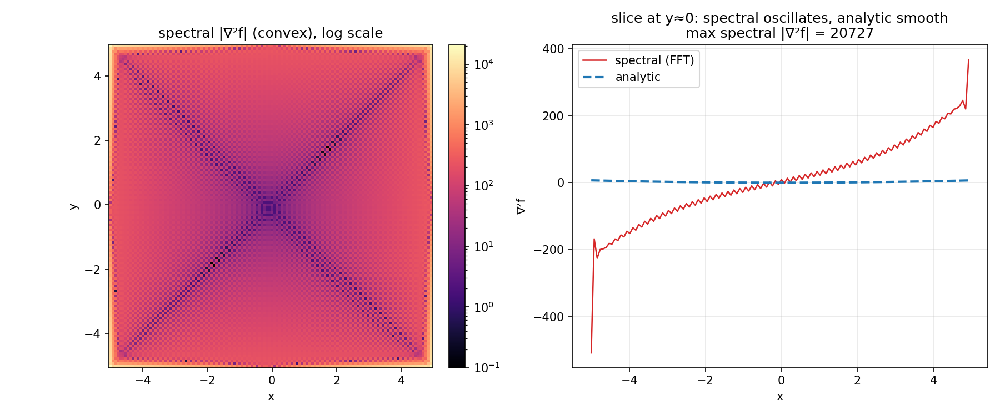
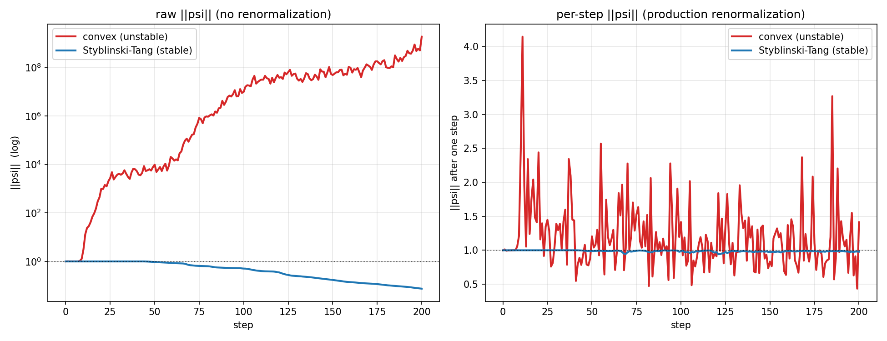

# Why the convex landscape is excluded from Part A

The convex quartic

```
f(x, y) = (x + y)^4 / 256 + (x - y)^4 / 128
```

is the one Part A test function omitted from the main comparison. This is a
**limitation of the spectral (Fourier) numerical method on a non-periodic
problem — not a failure of the gradient-based QHD algorithm.** The split-operator
QHD scheme is correct and reproduces the paper on the other four functions; the
convex case breaks the assumptions the *spectral discretization* relies on.

## Mechanism, step by step

1. **The landscape is non-periodic on its box.** The split-operator method
   differentiates via the FFT, which implicitly treats the grid as one period of
   a periodic function. A quartic on `[-5, 5]²` is not periodic: the implied
   periodic extension is discontinuous in value and slope at the box edge.

2. **→ Gibbs oscillations in the spectral Laplacian.** Differentiating that
   implied discontinuity spectrally produces ringing concentrated at the
   boundary. The spectral `|∇²f|` reaches **≈ 2.1 × 10⁴**, versus an analytic
   maximum of only ≈ 28. A 1-D slice shows the spectral derivative oscillating by
   hundreds while the true Laplacian stays near zero:

   

3. **→ An ill-conditioned H2 solve.** The gradient-correction term H2 is advanced
   with a Crank–Nicolson (Cayley) step `(I − ½A)`, `A = −i·h·α/2 · L_H2`, solved
   by GMRES. The convex configuration uses a large step `h = 0.2` and `α = −0.1`,
   so the operator norm `‖½A‖` is large. A power-iteration estimate of the system
   condition number:

   | case | ‖L_H2‖ (est.) | ‖½A‖ | κ(CN) (est.) |
   |---|---|---|---|
   | convex (h=0.2, α=−0.1) | 2.6 × 10⁴ | 128 | **≈ 128** |
   | Styblinski–Tang (h=0.01, α=−0.05) | 6.1 × 10³ | 0.76 | ≈ 1.3 |

   Both functions are non-periodic quartics, so both have a large, Gibbs-inflated
   `‖L_H2‖`. The difference is the step size: Styblinski–Tang's 20× smaller `h`
   keeps the CN operator near the identity (κ ≈ 1.3, well-conditioned), while the
   convex case's large step pushes κ to ≈ 100×.

4. **→ Norm blowup.** The ill-conditioned, aliasing-corrupted solve is no longer
   norm-preserving. Without renormalization `‖ψ‖` grows by **~9 orders of
   magnitude** (1 → 1.8 × 10⁹ by step 200); with the production per-step
   renormalization the per-step norm still swings between 0.4 and 4.1, and the
   density ends up in high-`f` regions (E[f] = 48.6, far above the minimum of 0).
   The stable Styblinski–Tang run, by contrast, sits flat at ‖ψ‖ ≈ 0.98:

   

## Why the other four functions are fine

Michalewicz, Cube-Wave, Rastrigin and Styblinski–Tang are also non-periodic, but
their Part A configurations use much smaller steps (`h` = 0.005–0.02) and the
wavefunction decays to ≈ 0 well inside the box, so the boundary Gibbs content
never couples strongly into the dynamics. Their CN systems stay well-conditioned
and norm is preserved to ~1–2 %.

## Standard fixes (not implemented here)

The root cause is applying a periodic basis to a non-periodic problem. The
conventional remedies, none of which are needed for the four working functions:

- **Windowing / apodization** of `f` near the boundary so the periodic extension
  is smooth, suppressing the Gibbs ringing.
- **A non-periodic basis** — e.g. Chebyshev collocation with a differentiation
  matrix — instead of the FFT, which removes the periodicity assumption entirely.
- **A larger padded box** with the landscape tapered to a constant near the new
  edges, moving the discontinuity far from where `|ψ|²` has any mass.

A smaller step `h` would also reduce κ, but `h = 0.2` is the convex
configuration's prescribed value, so we exclude the function rather than change
its parameters.
