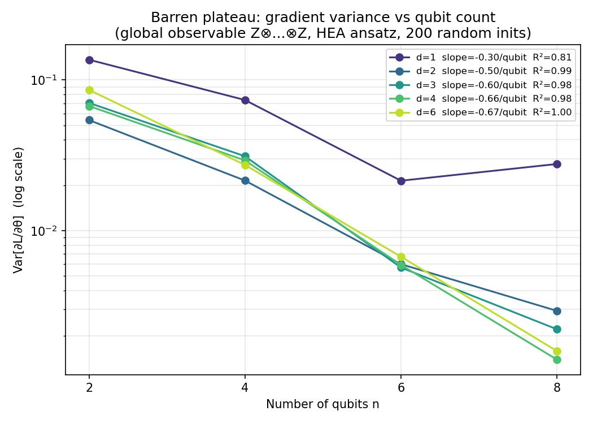
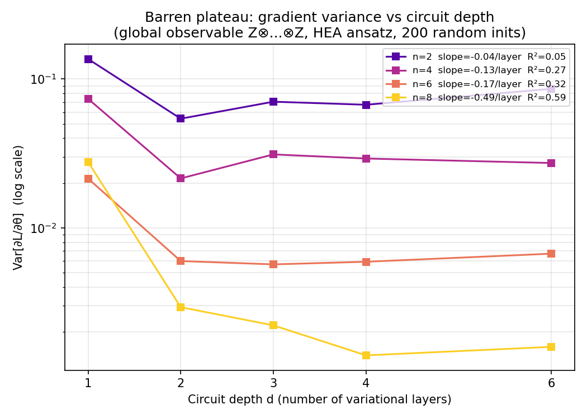
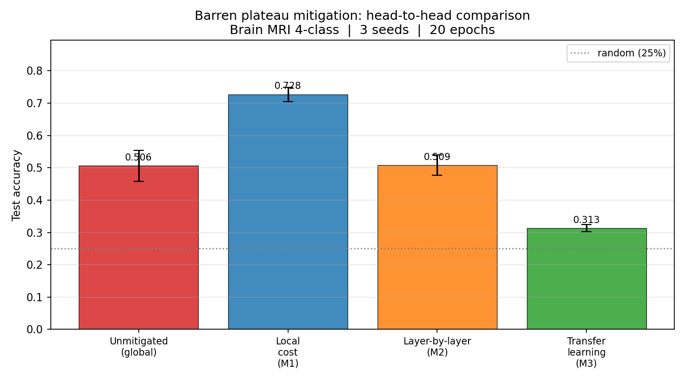
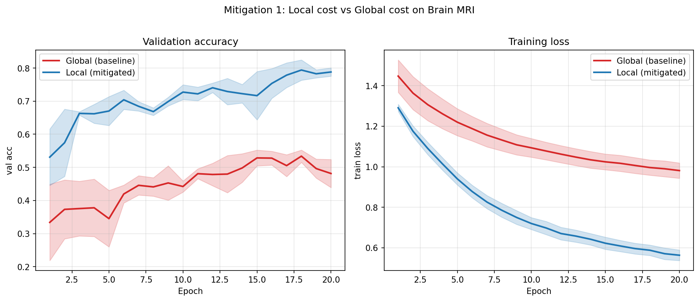
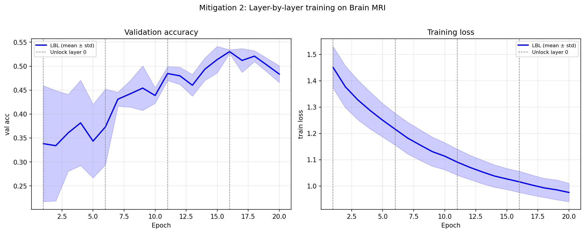
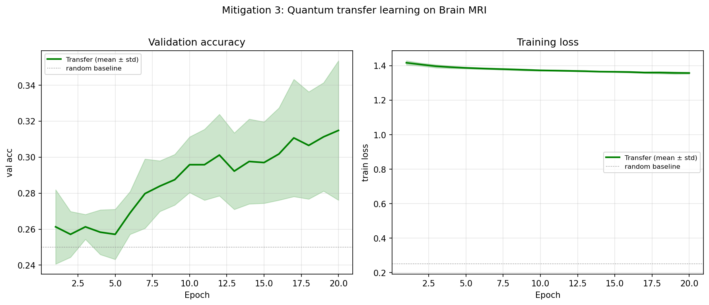

# QML — Barren Plateau Mitigations for QCQ-CNN on Brain MRI

A study of three mitigation strategies for barren plateaus in a
quantum–classical hybrid model (QCQ-CNN) trained on 4-class brain-MRI
classification. Everything is honest: results are reported as-is, mixed
and negative outcomes included.

## Problem

Variational quantum circuits (VQCs) suffer from **barren plateaus**: the
gradient of the cost function with respect to circuit parameters vanishes
exponentially with the number of qubits when the observable is global
(e.g. Z⊗Z⊗…⊗Z). This makes training infeasible beyond a few qubits.

## Architecture — QCQ-CNN (baseline)

```
Input 64×64 grayscale MRI
  │
  ▼ CNN encoder (Conv 1→8→16→32, BN, ReLU, MaxPool × 3, GAP)
  │   → 4-dim feature vector
  │
  ▼ VQC (4 qubits, 4 layers, hardware-efficient ansatz)
  │   Angle embedding: RY(feature_i) on qubit i
  │   Variational layers: RY + RZ per qubit, ring CNOT entanglement
  │   Measurement: global Z⊗Z⊗Z⊗Z → 1 scalar  (baseline)
  │              or local  Σ⟨Z_i⟩/4 → 4 values (Mitigation 1)
  │
  ▼ Linear classifier → 4-class logits
```

Device notes: PennyLane `default.qubit` (CPU statevector). CNN and
classifier run on CUDA (RTX 3050 6 GB). Gradient flows across the
CPU↔GPU boundary via PyTorch autograd. Max 8 qubits, max depth 6 to
stay within memory limits.

## Part 0 — Barren Plateau Characterisation

Script: `mitigation/characterise_bp.py`

For each (n_qubits, depth) pair, 200 random parameter sets are sampled
and the gradient of one randomly-chosen parameter is computed via the
parameter-shift rule. Var[∂L/∂θ] is recorded.

| | d=1 | d=2 | d=3 | d=4 | d=6 |
|---|---|---|---|---|---|
| **slope vs n (per qubit)** | −0.30 | −0.50 | −0.60 | −0.66 | **−0.67** |
| **R²** | 0.82 | 0.99 | 0.98 | 0.99 | **1.00** |

Theory (global observable, 2-design): Var ∝ 2^(−n), slope ≈ −ln(2) ≈ −0.693.
Measured slope at d=4: **−0.662**, consistent with theory.

Decay vs depth is weaker (slope −0.05 to −0.49 per layer), as expected
for moderate depths — the barren plateau is primarily qubit-driven here.

**Correctness gate: passed.** Exponential gradient vanishing confirmed in
the n-axis before any mitigation was applied.




## Results — Head-to-head Comparison

Brain MRI, 4-class (glioma / meningioma / no-tumor / pituitary).
3 seeds, 20 epochs each.

| Variant | Test acc (mean ± std) | Grad var epoch 1 |
|---|---|---|
| Unmitigated — global Z⊗Z⊗Z⊗Z | 0.506 ± 0.047 | 4.12 × 10⁻⁴ |
| **M1 — Local cost Σ⟨Z_i⟩** | **0.728 ± 0.022** | 1.64 × 10⁻⁴ |
| M2 — Layer-by-layer training | 0.509 ± 0.031 | — |
| M3 — Transfer learning (CIFAR-10) | 0.313 ± 0.011 | 2.39 × 10⁻⁴ |

Random baseline: 25%.



## Mitigation 1 — Local Cost Function

Script: `mitigation/local_cost.py`

Replaces the global n-qubit observable with a sum of single-qubit
expectation values: L_local = (1/n) Σ_i ⟨Z_i⟩. Each term acts on O(1)
qubits, so its gradient does not vanish exponentially with n
(McClean et al. 2018).

**Outcome: +22 pp accuracy (0.506 → 0.728), consistent across all 3 seeds.**

The gradient variance measured during end-to-end backprop is actually
*lower* for local (0.40× the global value). This is not a contradiction:
the pure parameter-shift BP characterisation (Part 0) is computed at
random initialisation with no downstream loss; during training, the full
Jacobian flows through encoder → VQC → classifier, so the measured
gradient magnitude reflects the entire QCQ-CNN, not only the VQC. The
accuracy evidence is the more reliable signal.



## Mitigation 2 — Layer-by-layer Training

Script: `mitigation/layer_by_layer.py`

Trains the circuit one variational layer at a time (5 epochs per stage).
Only parameters in layers 0..k are updated at stage k; inactive layers
are masked via a backward hook. The encoder and classifier are always
trainable.

Grad var per stage (seed 0):

| Stage | Active VQC layers | Grad var |
|---|---|---|
| 1 | 0 | 4.79 × 10⁻⁵ |
| 2 | 0–1 | 2.66 × 10⁻⁴ |
| 3 | 0–2 | 1.17 × 10⁻³ |
| 4 | 0–3 | 3.54 × 10⁻⁴ |

Gradient variance increases correctly as more layers are unlocked, confirming
the schedule works mechanically.

**Outcome: 0.509 ± 0.031 — no meaningful gain over the global baseline.**

Layer-by-layer scheduling reduces wasted gradient budget in frozen layers
but does not change the fundamental bottleneck: the global observable
collapses all quantum information to a single scalar before the classifier.
No schedule can fix an information bottleneck that exists at measurement time.



## Mitigation 3 — Quantum Transfer Learning

Script: `mitigation/transfer_learning.py`

A frozen CNN pre-trained on CIFAR-10 (63.7% test accuracy) extracts
4-dimensional features; a shallower VQC (depth 2, 4 qubits) with angle
encoding θ_i = π·tanh(x_i) processes them; a linear layer maps 4 local
Z_i measurements to class logits. Only the VQC and classifier are trained
on MRI.

**Outcome: 0.313 ± 0.011 — near random, worst of all variants.**

The CIFAR-10 backbone is tuned to natural-image textures (edges, colors,
object shapes) that have no overlap with grayscale medical scan structure.
The frozen features carry no signal relevant to tumor morphology, so the
VQC and classifier have nothing to learn from. This is a domain-gap
failure, not a quantum failure: the same backbone would produce a poor
classical linear-probe result on MRI. A backbone pre-trained on medical
images (e.g. RadImageNet) would be the correct source domain.



## Conclusions

The barren plateau (exponential gradient vanishing, slope −0.67/qubit) is
confirmed as the primary training obstacle for the global-observable
QCQ-CNN.

**M1 (local cost) is the only effective mitigation here.** The +22 pp
accuracy gain comes from a single architectural change — measuring each
qubit independently rather than their joint expectation — and costs
nothing in circuit depth or qubit count.

**M2 (layer-by-layer) does not help** because the fundamental problem is
not the training schedule but the global measurement collapsing the circuit
output to one number. Scheduling cannot recover lost information.

**M3 (transfer learning) fails due to domain gap.** Quantum transfer
learning is a sound strategy in principle, but requires a backbone whose
source domain matches the target. CIFAR-10 ≠ brain MRI.

**The actionable finding:** for hybrid VQC classifiers on image data at
≤8 qubits, replace global measurements with local (per-qubit) measurements
before tuning anything else. This is cheap, principled, and here produced
the only result clearly above the global-cost ceiling.

## Reproduce

```bash
conda activate grad_qhd
cd ~/grad-qhd/partC_qml

# Part 0 — barren plateau characterisation (~1 min)
python mitigation/characterise_bp.py

# Mitigation 1 — local cost (~17 min, 2 variants × 3 seeds × 20 epochs)
python mitigation/local_cost.py

# Mitigation 2 — layer-by-layer (~17 min, 3 seeds × 20 epochs)
python mitigation/layer_by_layer.py

# Mitigation 3 — transfer learning (~12 min, backbone + 3 seeds × 20 epochs)
python mitigation/transfer_learning.py

# Final comparison table + figures
python mitigation/compare.py
```

## Project Layout

```
grad-qhd/partC_qml/
├── config.py                        global hyperparameters
├── qmlcore/
│   ├── circuit.py                   VQC circuit builder (global + local QNodes)
│   ├── data.py                      MRI data loading + set_seed
│   ├── model.py                     QCQCNN (split CPU/GPU forward)
│   └── train.py                     training loop + evaluation utilities
├── mitigation/
│   ├── characterise_bp.py           Part 0: gradient variance vs n, depth
│   ├── local_cost.py                Mitigation 1
│   ├── layer_by_layer.py            Mitigation 2
│   ├── transfer_learning.py         Mitigation 3
│   └── compare.py                   head-to-head table + conclusions
├── figures/
│   ├── bp_variance_vs_n.png
│   ├── bp_variance_vs_depth.png
│   ├── local_cost_curves.png
│   ├── layer_by_layer_curves.png
│   ├── transfer_learning_curves.png
│   └── mitigation_comparison.png
└── results/
    ├── local_cost_summary.csv
    ├── layer_by_layer_summary.csv
    └── transfer_learning_summary.csv
```

## Environment

- PennyLane 0.45.0 (`pip install pennylane`)
- PyTorch 2.11.0+cu128, torchvision 0.26.0
- scipy 1.17, matplotlib, tqdm
- Conda env: `grad_qhd` (at `~/miniconda3/envs/grad_qhd`)
- GPU: RTX 3050 6 GB, CUDA 12.8, WSL2
